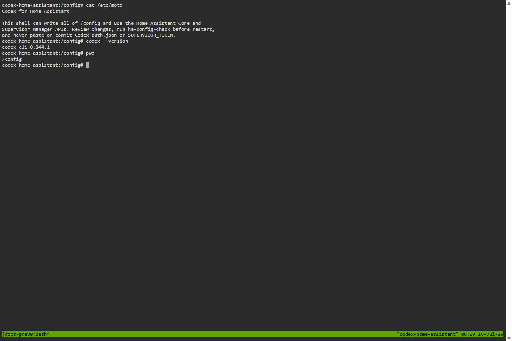
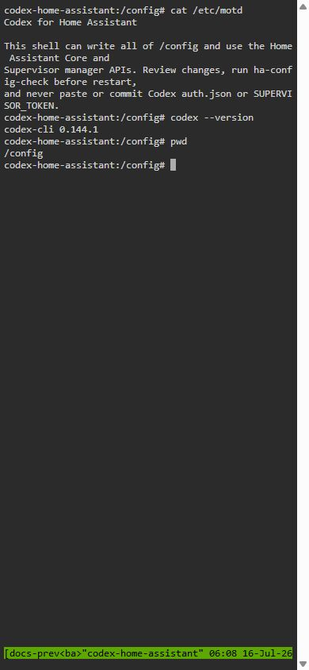
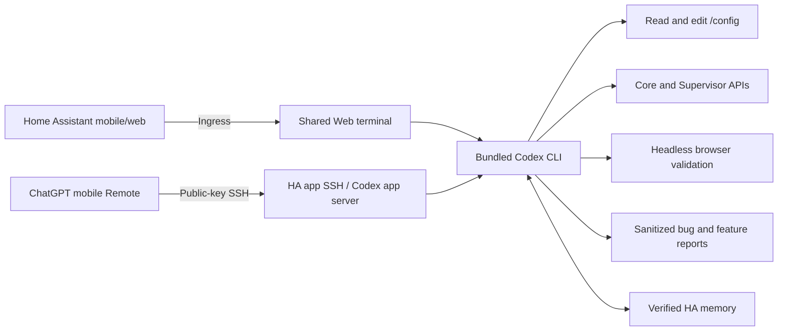

<p align="right">
  <a href="README.md">한국어</a> · <strong>English</strong>
</p>

<p align="center">
  
</p>

<h1 align="center">Codex for Home Assistant</h1>

<p align="center">
  Work with Codex inside Home Assistant to inspect your setup<br>
  and improve dashboards, automations, entities, and errors.
</p>

<p align="center">
  <a href="https://github.com/Kanu-Coffee/codex-for-home-assistant/releases"></a>
  <a href="https://github.com/Kanu-Coffee/codex-for-home-assistant/actions/workflows/ci.yaml"></a>
  
  
  <a href="LICENSE"></a>
</p>

<p align="center">
  <a href="https://my.home-assistant.io/redirect/supervisor_add_addon_repository/?repository_url=https%3A%2F%2Fgithub.com%2FKanu-Coffee%2Fcodex-for-home-assistant"></a>
</p>

> [!WARNING]
> This app can read and write all of `/config` and use the Home Assistant Core and Supervisor `manager` APIs. It is a powerful administrative tool. Back up your system and review the plan and diff before important changes. Never expose its SSH port directly to the internet.

This is an unofficial community project. It is not affiliated with or endorsed by OpenAI, Home Assistant, or Nabu Casa. The current release is **experimental and amd64-only**.

## Real Web terminal preview

<table>
  <tr>
    <th>Desktop</th>
    <th>Mobile</th>
  </tr>
  <tr>
    <td></td>
    <td width="31%"></td>
  </tr>
</table>

These images show the real Web terminal from the public `0.5.0` image, captured in an isolated Docker environment with no secrets. On HAOS, the terminal appears inside Home Assistant Ingress; the Home Assistant sidebar and Ingress frame are not shown here.

## What can it do?

| Goal | How Codex helps |
| --- | --- |
| Build a mobile dashboard | Inspect installed cards and existing dashboards, prepare a YAML draft and diff, then check the result at desktop and mobile sizes. |
| Create automations | Suggest candidates from your routines and current entities, then implement and verify only the items you approve. |
| Clean up entities | Find duplicate, unused, or broken-reference candidates and show their impact. Deletion or registry changes require separate confirmation. |
| Diagnose errors | Review configuration files, `ha-config-check`, Core/App logs, and current state together, then propose the smallest fix. |
| Prepare app bug or improvement feedback | `$ha-feedback` checks only the app scope in read-only mode, produces a sanitized environment/evidence report, and asks you to review the final public body. |
| Work directly on Home Assistant | Change `/config` files and use supported Core/Supervisor APIs, then recheck results through fresh APIs where possible. |
| Continue while away from home | Use the Ingress terminal in the Home Assistant mobile app or website, or connect ChatGPT mobile Remote directly to the app's SSH endpoint. |
| Preserve context about your home | Keep verified HA structure and user-stated aliases, purposes, and preferences in this project's local memory, then retrieve only relevant context for later work. |

Custom cards such as Bubble Card and Mushroom are not bundled with the app. Ask Codex to use components you already have, or to present an installation plan for review first.

## How it works



- The **Web UI** is a `ttyd` terminal backed by a shared `tmux` session inside Home Assistant Ingress. It is not a dedicated chat interface.
- **Codex** runs in `/config` and can use configuration files, helper commands, APIs, and Headless Chromium together.
- Reconnecting returns you to the same `tmux` session, so work continues after you close the browser while the app remains running.
- **Browser validation** uses Codex's built-in tools to check desktop and mobile layouts, console messages, and network failures in dashboards and web interfaces.

## Install in five minutes

### Requirements

- Home Assistant OS or another installation with Supervisor
- An **amd64** device
- Internet access to download the public image
- An OpenAI/ChatGPT account with access to Codex

### Install and start

1. Use the **Add the app repository to Home Assistant** button above, or add this URL under **Repositories** in the App store:

   ```text
   https://github.com/Kanu-Coffee/codex-for-home-assistant
   ```

2. Install and start **Codex for Home Assistant**. The default is `boot: manual`.
3. Select **OPEN WEB UI**.
4. Sign in to Codex once:

   ```bash
   ha-codex-login
   ```

5. Complete the displayed URL and code in a trusted browser, then start Codex:

   ```bash
   ha-codex
   ```

6. Start with a read-only request:

   ```text
   Inspect my current Home Assistant setup in read-only mode.
   Summarize the dashboards, automations, entities, and recent errors,
   but do not change anything yet.
   ```

See the [English user guide](codex_home_assistant/DOCS.en.md) for complete installation, sign-in, SSH, update, and recovery instructions.

## Prompts to try

### Bubble Card mobile dashboard

```text
First check whether Bubble Card is already installed.
Back up the current dashboard, then design a one-column mobile dashboard
that puts my most-used lights, climate controls, and security status on one screen.
Show me the plan and YAML diff first. After I approve it, apply the change
and validate the result at 390x844, including any errors.
```

### Automation ideas based on daily routines

```text
On weekdays I wake at 07:00, leave at 08:10, and usually return at 19:00.
Inspect my current entities and automations, then suggest five new automations
in priority order. Include the benefit, false-trigger safeguards, and required sensors.
Do not edit any files yet.
```

### Entity and error cleanup

```text
Find entities that appear unused by my dashboards, automations, and scripts,
as well as items that repeatedly become unavailable or unknown.
Show each item's references and cleanup risk in a table. Do not delete anything.
```

### Validate an app bug or feature request

```text
$ha-feedback bug The same symptom returns after reconnecting to the Web UI. Diagnose only the app in read-only mode and prepare a report.
```

```text
$ha-feedback feature I have an improvement request for this app. Check current behavior and alternatives first, then prepare a proposal with acceptance criteria.
```

[More English prompt examples](docs/examples.en.md) · [한국어 프롬프트 예시](docs/examples.ko.md)

## Two ways to work from a phone

| Method | Setup | What to expect |
| --- | --- | --- |
| Home Assistant Ingress | Start the app and select **OPEN WEB UI** | The simplest option. Use the same terminal session in the HA mobile app or mobile web interface. |
| ChatGPT mobile Remote | A public key and the HA app's SSH host and port | Connect directly to the HA app's SSH endpoint to start tasks, send follow-ups, approve actions, and inspect results from a phone. |

The mobile Remote path is **ChatGPT mobile Remote → public-key SSH → the Codex app server bundled in this HA app → `/config`**. No separate Mac/Windows desktop app or relay host is required. The HA app must be running and its SSH host port must be reachable from the phone; use a VPN or mesh VPN instead of exposing that port directly to the internet. See [ChatGPT mobile Remote in the user guide](codex_home_assistant/DOCS.en.md#chatgpt-mobile-remote) for setup details.

## Verified Home Assistant memory

This project's `ha_memory` is a local SQLite/MCP workflow. It is separate from OpenAI Codex Memories.

- It indexes area, device, entity, and automation structure verified through the Core API in `/data`.
- It records durable aliases, purposes, preferences, notes, and informal relationships explicitly provided by the user through candidate → verification → application stages.
- It retrieves only a small result relevant to the current question instead of putting the full database into every prompt.
- It does not store raw conversations, current or historical state values, automation action/template bodies, tokens, or passwords.
- Fresh Home Assistant API data takes priority for structural facts. Conflicts remain visible for review instead of being silently overwritten.

This does not mean the model trains itself or operates your home without approval. Version `0.6.0` remains experimental, and the complete natural-language memory-to-recall flow has not yet been publicly validated on real HAOS hardware.

## Key settings

Keep the defaults when getting started.

| Setting | Default | Purpose |
| --- | --- | --- |
| `authorized_keys` | `[]` | SSH public keys. When empty, only SSH is disabled. |
| `web_terminal_auto_start_codex` | `false` | Automatically start Codex in a new Web terminal session. |
| `codex_approval_policy` | `on-request` | Approval policy for command execution. |
| `codex_sandbox_mode` | `danger-full-access` | Codex permissions inside the app container. This is not HAOS host `full_access`. |
| `browser_approval_policy` | `safe` | Automatically allow inspection and capture, but confirm clicks and input. |
| `codex_user_files_update_mode` | `preserve` | Preserve user Codex settings and instructions during updates. |
| `home_assistant_browser_auto_auth` | `true` | Manage a local-only, read-only HA user for the Headless browser. |
| `log_level` | `info` | Web terminal log level. |

See [all app settings](codex_home_assistant/DOCS.en.md#app-settings) for accepted values, restart requirements, and `refresh_all` precautions.

## A safe way to work

1. Begin with: “Inspect in read-only mode and do not change anything yet.”
2. Review the target, backup method, expected diff, and validation plan.
3. Approve broad work, such as dashboards and automations, in small units.
4. After applying a change, check `ha-config-check`, fresh API state, and the browser view.
5. Treat locks, alarms, garage doors, heating, water, host reboots, and backup restores as separate high-impact actions. State them explicitly and review the latest result immediately before execution.

`danger-full-access` is a policy inside the app container, but `/config` is mounted read-write, so the app still has substantial power over Home Assistant. Never print or share `secrets.yaml`, `.storage`, the Recorder database, or `SUPERVISOR_TOKEN` in Git, issues, or chat.

## Current limitations

- Only amd64 is supported. aarch64 is not yet supported.
- This is a Home Assistant App (formerly called an Add-on), so it cannot be installed through HACS.
- The default is `boot: manual`, and the release stage remains `experimental`.
- The Web UI is a terminal, not a dedicated mobile chat interface.
- Bubble Card and other custom cards are not bundled.
- The read-only user used for Headless browser authentication can see all entity states, so screenshots and diagnostics may still be sensitive.
- Generated results depend on your environment and prompt. Review the diff and backup before applying them.

## Documentation and support

| Document | Audience |
| --- | --- |
| [English user guide](codex_home_assistant/DOCS.en.md) | Installation, settings, Web UI, SSH, Remote, updates, and troubleshooting |
| [한국어 사용 설명서](codex_home_assistant/DOCS.md) | Korean installation and operations guide |
| [Prompt examples](docs/examples.en.md) | Dashboard, automation, cleanup, and diagnostic requests |
| [Support guide](SUPPORT.md) | `$ha-feedback`, redaction, GitHub sign-in/submission, and fallback |
| [Security policy](.github/SECURITY.md) | Permission model and private vulnerability reporting |
| [Changelog](codex_home_assistant/CHANGELOG.md) | Features and upgrade notes by version |
| [Development documentation](docs/development/README.md) | Architecture, product contract, ADRs, tests, and validation records |

If something goes wrong, use the [support guide](SUPPORT.md) to prepare sanitized diagnostic information, then open a [GitHub Issue](https://github.com/Kanu-Coffee/codex-for-home-assistant/issues). Report vulnerabilities privately through the process in the [security policy](.github/SECURITY.md), not in a public issue.

Direct GitHub submission through `$ha-feedback` requires a ten-minute single-use preview and separate confirmation. Search or external-result uncertainty never triggers an automatic retry; use the Issue Form fallback instead.

## License

Project source is distributed under the [Apache License 2.0](LICENSE). See [THIRD_PARTY_NOTICES.md](THIRD_PARTY_NOTICES.md) for runtime dependency notices.
