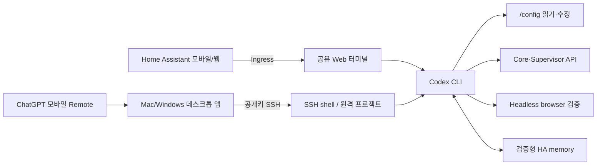

<p align="right">
  <strong>한국어</strong> · <a href="README.en.md">English</a>
</p>

<p align="center">
  
</p>

<h1 align="center">Codex for Home Assistant</h1>

<p align="center">
  Home Assistant 안에서 Codex와 대화하며 설정을 살펴보고,<br>
  대시보드·자동화·엔티티·오류를 함께 정리하는 Home Assistant 앱입니다.
</p>

<p align="center">
  <a href="https://github.com/Kanu-Coffee/codex-for-home-assistant/releases"></a>
  <a href="https://github.com/Kanu-Coffee/codex-for-home-assistant/actions/workflows/ci.yaml"></a>
  
  
  <a href="LICENSE"></a>
</p>

<p align="center">
  <a href="https://my.home-assistant.io/redirect/supervisor_add_addon_repository/?repository_url=https%3A%2F%2Fgithub.com%2FKanu-Coffee%2Fcodex-for-home-assistant"></a>
</p>

> [!WARNING]
> 이 앱은 `/config` 전체를 읽고 쓸 수 있고 Home Assistant Core 및 Supervisor `manager` API를 사용할 수 있는 강한 관리자 도구입니다. 중요한 변경 전에는 백업하고, 계획과 diff를 확인한 뒤 적용하세요. SSH 포트를 인터넷에 직접 공개하지 마세요.

비공식 커뮤니티 프로젝트이며 OpenAI 또는 Home Assistant/Nabu Casa와 제휴하거나 보증받은 제품이 아닙니다. 현재는 **amd64 전용 experimental 릴리스**입니다.

## 실제 Web 터미널 미리보기

<table>
  <tr>
    <th>데스크톱</th>
    <th>모바일</th>
  </tr>
  <tr>
    <td></td>
    <td width="31%"></td>
  </tr>
</table>

공개 `0.5.0` 이미지의 실제 Web 터미널을 비밀정보 없는 격리 Docker 환경에서 캡처했습니다. 실제 HAOS에서는 Home Assistant Ingress 안에 표시되며, 위 이미지에는 Home Assistant 사이드바와 Ingress frame이 포함되지 않았습니다.

## 무엇을 할 수 있나요?

| 하고 싶은 일 | Codex와 함께 하는 방식 |
| --- | --- |
| 모바일 대시보드 만들기 | 설치된 카드와 기존 대시보드를 조사하고, YAML 초안·diff를 만든 뒤 데스크톱/모바일 화면을 점검합니다. |
| 자동화 만들기 | 생활 패턴과 현재 엔티티를 바탕으로 후보를 제안하고, 승인한 항목만 구현·검증합니다. |
| 엔티티 정리하기 | 중복·미사용·참조 끊김 후보를 찾고 영향 범위를 보여 줍니다. 삭제나 registry 변경은 별도 확인 후 수행합니다. |
| 오류 원인 찾기 | 설정 파일, `ha-config-check`, Core/App 로그와 상태를 함께 살펴보고 최소 수정안을 제안합니다. |
| Home Assistant 직접 작업하기 | `/config` 파일과 지원되는 Core/Supervisor API를 이용해 변경하고, 가능한 경우 fresh API로 결과를 다시 확인합니다. |
| 이동 중 이어서 작업하기 | Home Assistant 모바일 앱/웹의 Ingress 터미널을 사용하거나, 데스크톱 SSH 프로젝트를 ChatGPT 모바일 Remote에서 이어갑니다. |
| 집의 맥락 기억시키기 | HA 구조와 사용자가 명시한 별칭·용도·선호를 이 프로젝트의 검증형 로컬 메모리에 보존해 다음 작업에서 관련 정보만 찾습니다. |

Bubble Card, Mushroom 같은 커스텀 카드는 앱에 포함되지 않습니다. 이미 설치된 구성요소를 활용하거나 설치 계획을 먼저 검토하도록 요청하세요.

## 작동 방식



- **Web UI**는 Home Assistant Ingress 안에서 열리는 `ttyd` + `tmux` 터미널입니다. 별도 채팅형 GUI가 아닙니다.
- **Codex**는 `/config`에서 실행되며 설정 파일, helper 명령, API와 Headless Chromium을 함께 사용할 수 있습니다.
- **재접속**하면 같은 `tmux` 세션으로 돌아가므로 브라우저를 닫아도 앱이 실행 중인 동안 작업이 이어집니다.
- **브라우저 검증**은 대시보드와 웹 UI의 데스크톱/모바일 레이아웃, console, network 오류를 확인하는 Codex 내부 도구입니다.

## 5분 설치

### 요구사항

- Home Assistant OS 또는 Supervisor가 있는 설치 환경
- **amd64** 장치
- 공개 이미지를 내려받을 인터넷 연결
- Codex를 사용할 수 있는 OpenAI/ChatGPT 계정

### 설치와 첫 실행

1. 위 **Home Assistant에 앱 저장소 추가** 버튼을 누르거나 App store의 **Repositories**에 다음 URL을 추가합니다.

   ```text
   https://github.com/Kanu-Coffee/codex-for-home-assistant
   ```

2. **Codex for Home Assistant**를 설치하고 시작합니다. 기본값은 `boot: manual`입니다.
3. **OPEN WEB UI**를 누릅니다.
4. 처음 한 번 Codex에 로그인합니다.

   ```bash
   ha-codex-login
   ```

5. 표시된 URL과 코드를 신뢰하는 브라우저에서 완료한 뒤 Codex를 시작합니다.

   ```bash
   ha-codex
   ```

6. 첫 요청은 읽기 전용 조사로 시작하는 편이 안전합니다.

   ```text
   현재 Home Assistant 구성을 읽기 전용으로 살펴봐 줘.
   대시보드, 자동화, 엔티티와 최근 오류를 요약하되 아직 아무것도 수정하지 마.
   ```

전체 설치·로그인·SSH·업데이트 절차는 [한국어 사용 설명서](codex_home_assistant/DOCS.md)를 확인하세요.

## 이렇게 요청해 보세요

### Bubble Card 모바일 대시보드

```text
Bubble Card가 이미 설치되어 있는지 먼저 확인해 줘.
현재 대시보드를 백업한 뒤 자주 쓰는 조명, 공조, 보안 상태를 한 화면에 모은
모바일 1열 대시보드를 설계해 줘. 먼저 계획과 YAML diff만 보여 주고,
내가 승인하면 적용한 다음 390x844 화면과 오류를 검증해 줘.
```

### 생활 패턴 기반 자동화 제안

```text
평일에는 07:00에 일어나 08:10에 외출하고 보통 19:00에 귀가해.
현재 엔티티와 자동화를 살펴보고 새로 만들 만한 자동화 5개를
효과, 오작동 방지 조건, 필요한 센서와 함께 우선순위로 제안해 줘.
지금은 파일을 수정하지 마.
```

### 엔티티·오류 정리

```text
현재 대시보드, 자동화, 스크립트에서 참조되지 않는 엔티티 후보와
unavailable/unknown 상태가 반복되는 항목을 조사해 줘.
각 항목의 참조 위치와 정리 위험을 표로 보여 주고 삭제는 하지 마.
```

[더 많은 한국어 프롬프트 예시](docs/examples.ko.md) · [English examples](docs/examples.en.md)

## 모바일에서 사용하는 두 가지 방법

| 방법 | 준비 | 특징 |
| --- | --- | --- |
| Home Assistant Ingress | 앱 시작 후 **OPEN WEB UI** | 가장 간단합니다. HA 모바일 앱이나 모바일 웹 안에서 같은 터미널 세션을 사용합니다. |
| ChatGPT 모바일 Remote | 데스크톱 앱, 공개키 SSH, Remote 페어링 | 휴대폰에서 새 작업·후속 지시·승인·결과 확인이 가능합니다. 휴대폰이 HAOS에 직접 연결되는 구조는 아닙니다. |

모바일 Remote의 연결 경로는 **ChatGPT 모바일 → 같은 계정/워크스페이스의 Mac 또는 Windows 데스크톱 앱 → SSH로 이 앱의 `/config`**입니다. 데스크톱 호스트가 켜져 있고 온라인이며 앱이 실행 중이어야 합니다. 기능 제공 여부는 ChatGPT 플랜·지역·workspace 정책과 앱 버전에 따라 달라질 수 있습니다. 자세한 설정은 [사용 설명서의 모바일 Remote 절](codex_home_assistant/DOCS.md#chatgpt-모바일-remote)를 확인하세요.

## 검증형 Home Assistant 메모리

이 프로젝트의 `ha_memory`는 OpenAI Codex의 Memories 기능과 별개인 로컬 SQLite/MCP 워크플로입니다.

- Core API로 확인한 area, device, entity, automation 구조를 `/data`에 인덱싱합니다.
- 사용자가 명확히 말한 지속적인 별칭, 용도, 선호, note와 비정형 관계를 후보 → 검증 → 적용 단계로 기록합니다.
- 매 요청에서 전체 DB를 넣지 않고 현재 질문과 관련된 작은 결과만 검색합니다.
- raw 대화, 현재/과거 state 값, automation action/template 본문, token과 비밀번호는 저장하지 않습니다.
- 구조 정보는 fresh Home Assistant API를 우선하며, 충돌은 조용히 덮어쓰지 않고 확인 대상으로 남깁니다.

이는 모델 자체가 학습하거나 사람의 승인 없이 집을 운영한다는 뜻이 아닙니다. 현재 `0.5.0`은 experimental이며, 실제 HAOS의 자연어 기억→새 작업 회상 전체 흐름에는 아직 공개 검증 공백이 있습니다.

## 주요 설정

처음에는 기본값을 유지하는 것을 권장합니다.

| 설정 | 기본값 | 용도 |
| --- | --- | --- |
| `authorized_keys` | `[]` | SSH 공개키. 비어 있으면 SSH만 비활성화됩니다. |
| `web_terminal_auto_start_codex` | `false` | 새 Web 터미널 세션에서 Codex를 자동 시작합니다. |
| `codex_approval_policy` | `on-request` | 명령 실행 승인 정책입니다. |
| `codex_sandbox_mode` | `danger-full-access` | 앱 컨테이너 내부의 Codex 권한입니다. HAOS host의 `full_access`가 아닙니다. |
| `browser_approval_policy` | `safe` | 조회·캡처는 자동 승인하고 클릭·입력은 확인합니다. |
| `codex_user_files_update_mode` | `preserve` | 사용자 Codex 설정과 지침을 업데이트 중 보존합니다. |
| `home_assistant_browser_auto_auth` | `true` | Headless browser용 local-only read-only HA 사용자를 관리합니다. |
| `log_level` | `info` | Web 터미널 로그 수준입니다. |

모든 허용값, 재시작 필요 여부와 `refresh_all` 주의사항은 [설정값 전체 안내](codex_home_assistant/DOCS.md#앱-설정)를 확인하세요.

## 안전한 작업 습관

1. 먼저 “읽기 전용으로 조사하고 아직 수정하지 마”라고 요청합니다.
2. 변경 대상, 백업 방법, 예상 diff와 검증 방법을 확인합니다.
3. 대시보드·자동화처럼 범위가 큰 작업은 작은 단위로 승인합니다.
4. 적용 후 `ha-config-check`, fresh API 상태와 브라우저 화면을 확인합니다.
5. 도어록, 경보, 차고문, 난방, 급수, host 재부팅과 backup 복원은 별도로 명시하고 직전 결과를 다시 검토합니다.

`danger-full-access`는 앱 컨테이너 내부 정책이지만 `/config`가 read-write로 연결되어 있으므로 실질적인 Home Assistant 변경 권한은 큽니다. `secrets.yaml`, `.storage`, Recorder DB와 `SUPERVISOR_TOKEN`을 출력하거나 Git·이슈·채팅에 공유하지 마세요.

## 현재 제한사항

- amd64만 지원합니다. aarch64는 아직 지원하지 않습니다.
- Home Assistant 앱(이전 명칭: Add-on)이므로 HACS로 설치할 수 없습니다.
- 기본 `boot: manual`이며 아직 `stage: experimental`입니다.
- Web UI는 터미널입니다. 전용 모바일 채팅 인터페이스가 아닙니다.
- Bubble Card와 다른 커스텀 카드는 포함하지 않습니다.
- Headless browser 자동 인증의 read-only 사용자는 모든 entity state를 볼 수 있으므로 screenshot과 진단 결과도 민감할 수 있습니다.
- 자동 생성 결과는 환경과 요청에 따라 달라집니다. 적용 전 diff와 backup을 검토해야 합니다.

## 문서와 지원

| 문서 | 대상 |
| --- | --- |
| [한국어 사용 설명서](codex_home_assistant/DOCS.md) | 설치, 설정, Web UI, SSH, Remote, 업데이트, 문제 해결 |
| [English user guide](codex_home_assistant/DOCS.en.md) | English installation and operations guide |
| [프롬프트 예시](docs/examples.ko.md) | 대시보드, 자동화, 정리, 진단 요청 모음 |
| [지원 안내](SUPPORT.md) | 로그 수집, 민감정보 제거, 이슈 작성 |
| [보안 정책](.github/SECURITY.md) | 권한 모델과 비공개 취약점 제보 |
| [변경 기록](codex_home_assistant/CHANGELOG.md) | 버전별 기능·업그레이드 주의사항 |
| [개발 문서](docs/development/README.md) | 아키텍처, 제품 계약, ADR, 테스트·검증 기록 |

문제가 생기면 먼저 [지원 안내](SUPPORT.md)에 따라 비밀정보를 제거한 진단 자료를 준비한 뒤 [GitHub Issues](https://github.com/Kanu-Coffee/codex-for-home-assistant/issues)를 이용해 주세요. 보안 취약점은 공개 이슈가 아닌 [보안 정책](.github/SECURITY.md)의 비공개 경로로 제보해 주세요.

## 라이선스

프로젝트 소스는 [Apache License 2.0](LICENSE)으로 배포됩니다. 런타임 의존성 고지는 [THIRD_PARTY_NOTICES.md](THIRD_PARTY_NOTICES.md)를 확인하세요.
