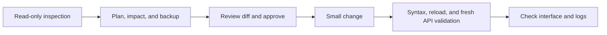

<p align="right">
  <a href="DOCS.md">한국어</a> · <strong>English</strong>
</p>

# Codex for Home Assistant user guide

This guide explains how Home Assistant OS users can install the app, use Codex through the Web UI, SSH, or mobile Remote, and safely work on dashboards, automations, entities, and configuration errors.

This guide applies to public app version `0.5.0`.

> [!WARNING]
> This app can read and write all of `/config` and use the Home Assistant Core and Supervisor `manager` APIs. Allow only trusted administrators to use it, and review a backup and diff before making changes. Never port-forward TCP `2223` directly to the internet.

## Before you begin

### Supported environments

- Home Assistant OS or another installation with Supervisor
- An **amd64** device
- Internet access for the app image and Codex authentication
- An OpenAI/ChatGPT account with access to Codex

The app is currently `stage: experimental` and `boot: manual`. aarch64 devices and HACS installation are not supported.

### What the app provides

- A Web terminal inside Home Assistant Ingress
- Codex CLI running from `/config`
- Core REST API and Supervisor `manager` API helpers
- Public-key-only SSH and desktop Codex SSH projects
- Playwright tools that inspect dashboards and web interfaces in real Headless Chromium
- This project's own `ha_memory` for verified HA structure and durable information explicitly provided by the user

The Web UI is a terminal built with `ttyd` and a shared `tmux` session, not a dedicated chat interface. Dashboard and automation creation are not separate wizards; Codex performs the work by combining `/config`, APIs, and browser validation.

## Installation

### Add the app repository

[](https://my.home-assistant.io/redirect/supervisor_add_addon_repository/?repository_url=https%3A%2F%2Fgithub.com%2FKanu-Coffee%2Fcodex-for-home-assistant)

If the button does not work, copy this URL:

```text
https://github.com/Kanu-Coffee/codex-for-home-assistant
```

1. In Home Assistant, open **Settings → Apps → App store**.
2. Open the menu in the upper-right corner and add the URL above under **Repositories**.
3. Refresh the App store and select **Codex for Home Assistant**.
4. Select **Install**. The app uses a prebuilt amd64 image from public GHCR, so your HA device does not compile the source.
5. Start the app with its default settings for the first run.

If the app does not appear, confirm that your device architecture is amd64. If installation fails, keep the App and Supervisor logs, but do not share tokens, internal URLs, or personal information.

## First run

### 1. Open the Web UI

Start the app, then select **OPEN WEB UI**. The shell starts in `/config`.

With the default `web_terminal_auto_start_codex: false`, Bash opens first. Closing the browser does not end the shared `tmux` session while the app remains running; the next connection returns to the same session. Multiple browser tabs share the same screen and input, so allow access only to trusted administrators.

### 2. Sign in to Codex

Run this command once:

```bash
ha-codex-login
```

Open the displayed URL in a trusted browser and enter the one-time code. OpenAI documents device-code authentication for headless environments as beta, and your account or workspace policy may need to permit it.

Check the sign-in state:

```bash
codex login status
```

Authentication is stored in `/data/codex` and normally survives app restarts and updates. `auth.json` can contain access tokens; never print it or share it in Git, issues, or chat.

### 3. Start Codex

```bash
ha-codex
```

Begin with a read-only request such as:

```text
Inspect my current Home Assistant setup in read-only mode.
Summarize the dashboards, automations, entities, and recent errors,
then suggest possible improvements. Do not change files, registries,
or device states yet.
```

## App settings

Keep the defaults when getting started. After changing settings, restart the app. If you changed a Codex policy or MCP tool, also exit the running Codex process and start a new session.

| Setting | Default | Accepted values and meaning | Caution |
| --- | --- | --- | --- |
| `authorized_keys` | `[]` | OpenSSH public keys allowed to connect | When empty, only SSH is disabled; the Web UI remains available. Never enter a private key. |
| `web_terminal_auto_start_codex` | `false` | Start Codex once in each new `tmux` session | Does not affect an existing session. Exiting Codex returns to Bash. |
| `tmux_session_name` | `codex-ha` | A 1–64 character session name using letters, numbers, `.`, `_`, or `-` | A change takes effect in a new session. |
| `codex_approval_policy` | `on-request` | `untrusted`, `on-request`, or `never` | `never` grants broad automatic approval. Use it only for trusted work. |
| `codex_sandbox_mode` | `danger-full-access` | `workspace-write` or `danger-full-access` | This controls the app container, but `/config` is read-write and changes can affect Home Assistant. |
| `browser_approval_policy` | `safe` | `safe`, `never`, or `always` | `safe` auto-approves inspection and capture but confirms clicks and input. |
| `codex_user_files_update_mode` | `preserve` | `preserve`, `refresh_agents`, or `refresh_all` | Return to `preserve` after a one-time refresh. `refresh_all` can reset user Codex configuration. |
| `home_assistant_browser_auto_auth` | `true` | Automatically manage a dedicated local-only, read-only HA user for the Headless browser | Restart the app and browser session after turning it off or on. |
| `home_assistant_browser_token` | None | Optional manual long-lived token override | Advanced recovery only. It overrides the managed token only while automatic authentication is on; the user must be local-only, non-admin, and in only the `system-read-only` group. |
| `log_level` | `info` | `trace`, `debug`, `info`, `notice`, `warning`, `error`, or `fatal` | Use `trace` or `debug` only for diagnostics, and review logs before sharing. |
| Network `22/tcp` | `2223` | External SSH host port | This is not an `ssh_port` JSON option. Disable it if you do not want to expose the SSH listener. |

Recommended starting settings:

```yaml
authorized_keys: []
web_terminal_auto_start_codex: false
tmux_session_name: codex-ha
codex_approval_policy: on-request
codex_sandbox_mode: danger-full-access
browser_approval_policy: safe
codex_user_files_update_mode: preserve
home_assistant_browser_auto_auth: true
log_level: info
```

### Browser approval policy

| Value | Behavior |
| --- | --- |
| `safe` | Automatically approves navigation, snapshots, screenshots, and console/network inspection; confirms clicks, forms, keys, selections, and typing. |
| `never` | Skips individual approval prompts for currently allowed Playwright tools. It does not enable blocked code execution or arbitrary file uploads. |
| `always` | Requests confirmation for every allowed Playwright tool. |

The top-level `codex_approval_policy: never` is Codex's full-auto policy and may take precedence over confirmations from `browser_approval_policy: safe` or `always`. Do not treat the browser policy as a security boundary by itself.

### Updating Codex user files

| Value | Behavior |
| --- | --- |
| `preserve` | Preserves the existing `/data/codex/config.toml` and base `AGENTS.md`. This is the default. |
| `refresh_agents` | Replaces only the base `AGENTS.md` once with the default from the current app version. |
| `refresh_all` | Resets the base `AGENTS.md` and user `config.toml` once to the current app defaults. |

`refresh_all` can remove user-added models, providers, MCP servers, and other settings. Originals are saved in a root-only backup under `/data/codex/backups/user-files`, but that backup is also sensitive because it can contain credentials and internal endpoints. After confirming the refresh, return the mode to `preserve`; otherwise, the selected refresh runs once again when you install the next app version.

## Ways to connect

### Home Assistant Web UI and mobile access

This is the simplest option.

1. Sign in to Home Assistant through its mobile app or a mobile browser.
2. Open **Settings → Apps → Codex for Home Assistant → OPEN WEB UI**.
3. On a small screen, landscape orientation or an external keyboard may be more comfortable.

Ingress opens inside Home Assistant authentication, so you do not need to expose a separate Web UI port on your router. Remember that this interface is a terminal, not a standalone mobile chat app.

### Public-key SSH

SSH is optional. If you do not use it, leave `authorized_keys` empty and disable the Network port.

1. If your PC does not already have an Ed25519 key, create one:

   ```powershell
   ssh-keygen -t ed25519
   Get-Content "$HOME\.ssh\id_ed25519.pub"
   ```

2. Add the single output line beginning with `ssh-ed25519` to `authorized_keys`, then restart the app. Never copy the `id_ed25519` private key.
3. In the app's **Network** settings, check the host port for `22/tcp`. The default is `2223`.
4. Add a specific host alias to `~/.ssh/config` on your PC:

   ```sshconfig
   Host codex-ha
     HostName homeassistant.local
     User root
     Port 2223
     IdentityFile ~/.ssh/id_ed25519
     IdentitiesOnly yes
   ```

5. Confirm that regular SSH works first:

   ```powershell
   ssh codex-ha
   ```

Password and keyboard-interactive authentication are blocked. For access away from home, do not publish the SSH port. Connect to your home network through a trusted VPN or mesh VPN first.

### ChatGPT mobile Remote

Your phone does not connect directly to the HAOS app.

```text
ChatGPT mobile app
  → Mac/Windows desktop app in the same account and workspace
  → public-key SSH
  → /config in Codex for Home Assistant
```

1. Complete the SSH setup above and verify `ssh codex-ha` on the desktop PC.
2. In the remote shell, check `codex --version` and the sign-in state.
3. In the ChatGPT desktop app, open **Settings → Connections → SSH** and add or enable `codex-ha`.
4. Select `/config` as the remote project folder.
5. Start **Set up Remote** in the desktop app and scan the QR code with your phone.
6. Confirm that the phone and desktop use the same ChatGPT account and workspace, then complete any required MFA or SSO steps.

From mobile, you can start a task, continue an existing task, send follow-up instructions, approve actions, and inspect diffs, tests, and terminal results. The desktop host must be awake and online, and the ChatGPT app must be running. Remote availability can vary by plan, region, workspace policy, and app version. See OpenAI's [Remote connections](https://learn.chatgpt.com/docs/remote-connections) for the latest procedure.

## Common use cases

### Bubble Card mobile dashboard

Bubble Card is not bundled with this app. Ask Codex to check whether it is installed and how the current dashboard is stored before planning changes.

```text
Check whether Bubble Card is already installed and how my current dashboard is stored.
Preserve the existing dashboard and draft a one-column mobile view that brings together
my most-used lights, climate controls, and security status.
Show me the files to change and the diff first. After I approve, apply it and check
the screen, console, and network errors at both 1440x900 and 390x844.
```

YAML-mode and storage-mode dashboards require different update methods. Prefer supported UI or API paths over direct `.storage` edits, and never change a dashboard before confirming how it is stored.

### Automation ideas based on daily routines

```text
My weekday routine is wake at 07:00, leave at 08:10, and return around 19:00.
Inspect my current presence, light, temperature, and door sensors and automations
in read-only mode. Suggest five new automations in priority order, including the benefit,
trigger and conditions, false-trigger safeguards, and required entities.
Identify overlaps with existing automations and do not apply anything yet.
```

After reviewing the suggestions, ask Codex to implement them one at a time. After a change, check not just the YAML syntax but also the actual reload and fresh state.

### Entity cleanup

```text
Find entities that are not referenced by dashboards, automations, scripts, or templates.
Separate disabled, unavailable, duplicate-name, and stale-device-link candidates.
Show each candidate's references and removal risk in a table, and do not change the registry.
```

“Unused” is not sufficient proof that an entity can be deleted. Integrations can use entities dynamically, and external apps can hold references. Treat deletion, disabling, and renaming as separate approvals.

### Diagnose configuration errors

```text
Diagnose recent Home Assistant errors in read-only mode.
Check ha-config-check, Core/App logs, and related YAML, then rank possible causes
by strength of evidence. Propose the smallest change, but do not apply it yet.
```

See the [prompt collection](../docs/examples.en.md) for more examples.

## Validate the interface with the Headless browser

New Codex sessions automatically receive image-managed Playwright tools. You do not need to install a separate browser package or register an MCP server.

- Home Assistant dashboards use Codex's internal `http://127.0.0.1:8099` gateway.
- Do not open this address in an external PC browser or through Ingress.
- The default viewport is `1440x900`; change it to `390x844` to compare the mobile layout.
- Check screenshots, console warnings/errors, and network request status together.

```text
Open my current Home Assistant dashboard in the real browser.
At 1440x900 and 390x844, inspect screenshots, console errors and warnings,
failed network requests, clipped cards, and overlapping buttons.
Do not click or enter anything that changes the interface.
```

Automatic authentication is enabled by default. The app creates or reuses a dedicated local-only, non-admin user in the `system-read-only` group. This user cannot write settings, but it can see all entity states. Screenshots, snapshots, and console/network output can reveal locations, entities, internal URLs, and user information, so review them before sharing.

## Verified Home Assistant memory

`ha_memory` is a local SQLite/MCP feature implemented by this project. It is separate from OpenAI Codex Memories.

### What does it remember?

- Area, device, entity, and automation structure verified through the Core API
- Durable aliases, real-world purposes, preferences, notes, and informal relationships explicitly provided by the user
- An audit history of candidates, verification, application, conflicts, and rollback

It does not store:

- Raw conversations
- Current or historical states and timestamps
- Raw automation action or template content
- Full API responses, logs, or web pages
- Tokens, passwords, or Authorization headers

### How does it work?

1. For a new HA request, it searches only a small memory result relevant to the current question.
2. When the user clearly states durable information about one exact target, it attempts candidate → verification → application within the same request.
3. It asks for clarification instead of storing ambiguous information.
4. Fresh Core API results take priority for HA structure.
5. When new information conflicts with existing evidence, it records a conflict instead of silently overwriting the old value.

```text
We call light.kitchen_main the “prep light” in our home,
and we use it while preparing breakfast. Remember this for future tasks.
```

Administrator commands for checking the state:

```bash
ha-memory status
ha-memory search "prep light"
ha-memory show entity:light.kitchen_main
ha-memory conflicts --status open
```

Do not delete the memory database when its state is `empty`, `degraded`, or `stale`. It may still be learning the initial structure or recovering from a temporary Core connection failure, and it preserves the last successful snapshot.

This feature does not mean the model trains itself or operates your home without approval. Version `0.5.0` remains experimental, and the complete natural-language memory-to-recall flow has not yet been publicly validated on real HAOS hardware.

## Safe change procedure

Use this sequence:



1. Ask for a read-only inspection first.
2. Prepare a Home Assistant backup or a Git checkpoint for `/config`.
3. Review the files, entities, and services to be changed, along with the expected diff.
4. Apply only a small scope at a time.
5. Run `ha-config-check`, perform any necessary reload, and check fresh state.
6. Recheck dashboards with desktop and mobile browser sizes.

Perform the following actions only when they are explicitly included in the current request or separately approved immediately before execution:

- Unlocking doors, opening garage doors or gates, or disarming alarms
- Actions affecting safety or property, including heating, water, and access control
- Shutting down or rebooting the HAOS host
- Restoring a backup
- Removing apps, updating the OS, or deleting databases

Use Home Assistant UI or API paths for `.storage` whenever possible, and never write directly to the Recorder database. Never print or share `SUPERVISOR_TOKEN`, `auth.json`, SSH private keys, `secrets.yaml`, or browser tokens.

## Updating the app

1. If possible, create a Home Assistant backup and finish any in-progress Codex work.
2. Refresh the App store repository and use the normal **Update** action.
3. Do not completely remove the app or initialize `/data`.
4. Start the app after the update, exit the existing Codex process, and open a new session.
5. Check `codex login status`, required MCP tools, and key settings.

Normal updates are designed to preserve Codex authentication and settings, SSH host keys, and verified memory in `/data`. `codex_user_files_update_mode: preserve` is the default. If you leave `refresh_agents` or `refresh_all` selected when upgrading to the next version, the selected files refresh once again for that version. Return the setting to `preserve` after a one-time refresh.

It is normal for Web UI/tmux and SSH connections to drop briefly during an update.

## Helper commands

| Command | Purpose |
| --- | --- |
| `ha-codex` | Start Codex in `/config` |
| `ha-codex-login` | Start device-code sign-in |
| `ha-config-check` | Check the Home Assistant configuration |
| `ha-api` | Call the Core REST API |
| `supervisor-api` | Call the Supervisor API |
| `ha-core-logs` | Read Core logs |
| `ha-addon-logs SLUG` | Read logs for a named app |
| `ha-memory status` | Check verified memory state |
| `ha-memory search QUERY` | Search relevant HA structure and applied memory |
| `ha-browser-auth-status` | Check Headless browser authentication |
| `ha-browser-network-info` | Check the internal dashboard gateway connection |

Helpers attach tokens automatically. Do not expose runtime tokens with `env`, `printenv`, `set`, `export -p`, or `curl -v`.

## Troubleshooting

### The app does not start

- Find the first fatal error in the App log.
- The app intentionally refuses to start if `/config` is missing or not writable.
- A warning that no public key is configured is normal if the Web UI works; only SSH is disabled.

### The Web UI stays on the reconnect screen

- Confirm that the app is running, then inspect the App log for nginx or ttyd errors.
- Check whether multiple tabs are attached to the same tmux session.
- Resetting the session terminates the running Codex process and commands. Use this only when necessary:

  ```bash
  tmux kill-session -t codex-ha
  ```

### Codex sign-in fails

- Run `codex login status`.
- Confirm that your account or workspace allows device-code sign-in.
- Do not print the app's `auth.json` file.
- See [Codex authentication](https://developers.openai.com/codex/auth) for the latest official procedure.

### SSH connection fails

- Confirm that `authorized_keys` contains one correct public-key line.
- Confirm that the app Network host port matches `Port` in `~/.ssh/config`.
- Use `ssh -v codex-ha` first to inspect the host, port, and selected key. Redact private paths and addresses before sharing output.
- Do not ignore or immediately delete a “host key changed” warning. Verify the fingerprint through the trusted app Web UI first.

### The dashboard browser only shows a sign-in page

```bash
ha-browser-auth-status
ha-browser-network-info
```

- Confirm that `home_assistant_browser_auto_auth` is ON.
- Restart the app and the existing Codex/browser session.
- Only if it continues to fail, run `ha-browser-auth-setup` and inspect its sanitized error.
- Do not automatically modify `trusted_networks`, `trusted_proxies`, or `.storage` as a workaround.

### Memory reports `empty`, `degraded`, or `stale`

```bash
ha-memory status
```

Give Core time to become ready and check again. Do not directly delete or edit the database or WAL files. Collect the app version, Core version, and the status's closed error code, but do not share raw tokens or API responses.

### A setting was changed incorrectly

1. Stop the related Codex task and automations.
2. Revert the change with a Git diff or backup.
3. Run `ha-config-check`.
4. Restore a full backup only after reviewing the impact and granting separate approval.

## Remove the automatic browser user and uninstall the app

If you no longer want the Headless browser identity created by the app:

1. Save `home_assistant_browser_auto_auth` as OFF.
2. Restart the app and any existing browser/Codex sessions.
3. Check the state, then remove it:

   ```bash
   ha-browser-auth-status
   ha-browser-auth-remove
   ```

4. After removal completes, stop and uninstall the app if desired.

Before uninstalling, decide how to handle any Codex configuration and authentication, memory, and SSH identity in `/data` that you need to retain. Backups can contain credentials and sensitive Home Assistant context.

## Limitations and support

- The app is amd64-only, `stage: experimental`, and `boot: manual` by default.
- It does not bundle or automatically install Bubble Card or other custom cards.
- The Web UI is a terminal, not a dedicated chat interface.
- Automation and dashboard results vary by environment and prompt and require human review.
- Public validation of the complete `0.5.0` natural-language memory loop on real HAOS hardware is still incomplete.
- Supervisor endpoints and OpenAI Remote availability can vary with Home Assistant/OpenAI versions and policies.

Before requesting support, follow [SUPPORT.md](../SUPPORT.md) to remove tokens, internal URLs, entities, and user information. Use [GitHub Issues](https://github.com/Kanu-Coffee/codex-for-home-assistant/issues) for general problems and the private process in [SECURITY.md](../.github/SECURITY.md) for vulnerabilities.

This is an unofficial community project. It is not affiliated with or endorsed by OpenAI, Home Assistant, or Nabu Casa. Source is distributed under the [Apache License 2.0](../LICENSE).
